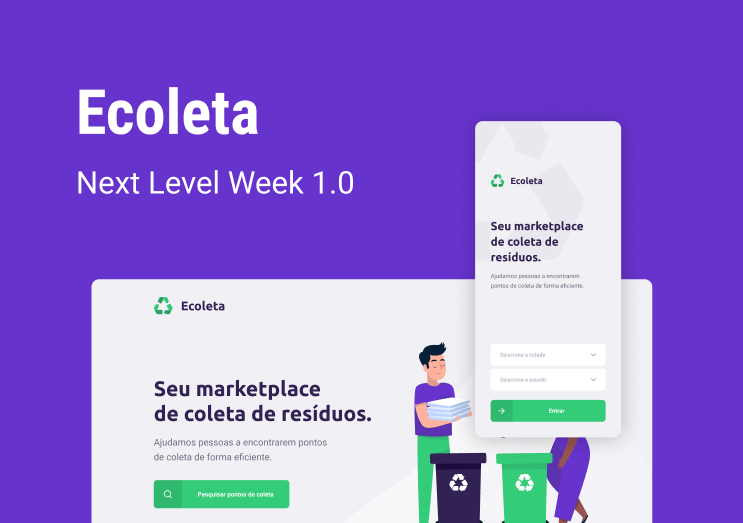

# Ecoleta
### Projeto desenvolvido na Next Level Week 1.0 que tem o intuito de conectar locais/mercados que coletam resíduos de reciclagem com pessoas que estão dispostas a colaborar.

 

### O projeto contém front web, mobile e back.

### Instalação de dependências:
- Entre na pasta específica de ecoweb, mobile ou server
- ```npm i```
- No caso do server será necessário configurar o banco de dados para a instalação

### Rodar o projeto:
- ```npm start```
